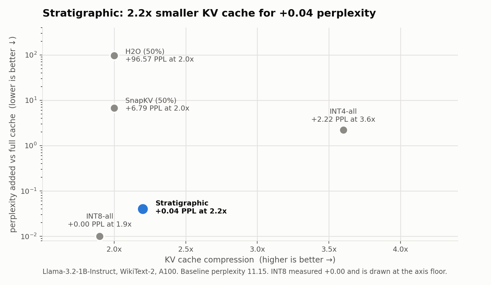
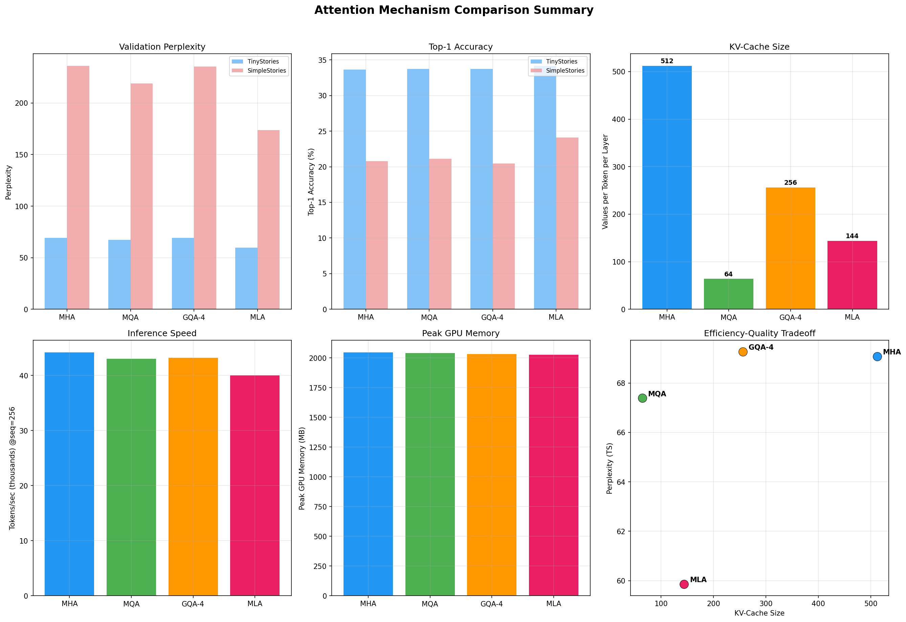

# KV Cache Optimization

Making the KV cache smaller without making the model worse. The headline result:
**a 2.2x smaller KV cache for +0.04 perplexity** on Llama-3.2-1B-Instruct.

<picture>
  <source media="(prefers-color-scheme: dark)" srcset="docs/assets/headline-dark.png">
  
</picture>

| Strategy | Perplexity | ΔPPL | Compression |
|----------|-----------|------|-------------|
| FullKV (baseline) | 11.15 | — | 1.0x |
| **Stratigraphic** | **11.18** | **+0.04** | **2.2x** |
| INT8-all | 11.15 | +0.00 | 1.9x |
| INT4-all | 13.37 | +2.22 | 3.6x |
| SnapKV (50%) | 17.94 | +6.79 | 2.0x |
| H2O (50%) | 107.72 | +96.57 | 2.0x |

<sub>Llama-3.2-1B-Instruct, WikiText-2, A100. Recorded in
<a href="docs/DIARY.md">docs/DIARY.md</a> (Day 20) and reproducible with
<a href="streaming_attention/notebooks/03-kv-bench-modal.ipynb">03-kv-bench-modal.ipynb</a>.
Regenerate the chart with <code>uv run --with matplotlib python docs/make_headline_chart.py</code>.</sub>

The interesting part is not that compression works — it is *how differently* the
strategies fail. H2O and SnapKV compress by the same 2x and cost 96.57 and 6.79
perplexity respectively; Stratigraphic compresses more and costs 0.04. Deciding
which tokens to keep matters far more than how many.

**Stratigraphic** borrows from geology. Each KV head gets its own compression
profile, and tokens are "deposited" into zones they can only ever sink through —
FP16 → INT8 → INT4 → evict, never back up, so re-compression error cannot
compound. High-attention tokens are pinned at FP16 as anchors, and the layer
budget is inverted: early layers compress hardest, late layers keep the most
precision.

One debugging note worth recording, because it is the kind of bug that quietly
invalidates a benchmark: key quantisation was originally hooked at `k_proj`,
before RoPE, where it never reached the cache the model actually reads. INT4
scored a suspicious +0.00. Moving the hook into the `self_attn.forward` wrapper,
after RoPE, made INT4 report its real +2.22 — the "improvement" had been a
measurement artefact all along.

## What is in here

Three sub-projects, in the order they were built:

### Layout

```
KV-cache-optimization/
├── AttentionHeads/           Toy 16M-param models comparing MHA/MQA/GQA/MLA
│   ├── mha/                  Multi-Head Attention (baseline)
│   ├── mqa/                  Multi-Query Attention
│   ├── gqa/                  Grouped Query Attention
│   ├── mla/                  Multi-Head Latent Attention (DeepSeek-V2 style)
│   ├── notebooks/            Training and evaluation notebooks
│   └── results/              Comparison plots and analysis
│
├── streaming_attention/      Per-head KV cache → recurrent state conversion
│   ├── head_classifier.py    DuoAttention pattern loading + head classification
│   ├── state_attention.py    Decayed linear state: S_t = λ·S_{t-1} + v_t·k_tᵀ
│   ├── hybrid_attention.py   Monkey-patches Llama for hybrid KV/state attention
│   ├── calibration.py        Two-stage tuning: per-head MSE + LoRA fine-tuning
│   ├── importance.py         Multi-signal token importance scoring
│   ├── adaptive_cache.py     Tiered KV cache (FP16/INT8/INT4/evict)
│   ├── stratigraphic.py      Per-head zone assignment with geological metaphor
│   └── notebooks/            Experiments on H100 (zero-shot, calibration, benchmarks)
│
├── kv_bench/                 Benchmarking framework for KV cache strategies
│   ├── strategies/           8 strategy implementations (see kv_bench/README.md)
│   ├── runner.py             Model loading + strategy execution
│   └── report.py             Console/JSON/Markdown output
│
└── docs/                     Research diary and design documents
```

## Packages

### AttentionHeads

Foundational comparison of four attention architectures on TinyStories and SimpleStories datasets. Each variant is a ~16M parameter decoder-only transformer. See [AttentionHeads/README.md](AttentionHeads/README.md) for training instructions and results.

### streaming_attention

Production-scale KV cache optimization for Llama-3.1-8B-Instruct. Streaming heads (identified by DuoAttention) are converted to fixed-size recurrent state matrices, while retrieval heads keep full or tiered KV cache. Includes a two-stage calibration pipeline (decay alignment + LoRA) and multi-tier adaptive compression.

### kv_bench

Unified benchmarking framework comparing 8 KV cache strategies: FullKV baseline, H2O, SnapKV, INT8/INT4 uniform quantization, Stratigraphic compression, StreamingAttention, and Hybrid. See [kv_bench/README.md](kv_bench/README.md) for usage and strategy descriptions.

## Quick Start

```bash
pip install -e .                    # Install streaming_attention package
pip install -e ".[fla]"             # + Flash Linear Attention kernels
pip install -e ".[train]"           # + PEFT/Accelerate for calibration

# Run benchmarks
python -m kv_bench \
  --model meta-llama/Llama-3.1-8B-Instruct \
  --pattern-dir attn_patterns/Meta-Llama-3.1-8B-Instruct \
  --strategies baseline streaming_attention h2o snapkv int8 int4 \
  --output results.json -v
```

## Attention mechanism comparison

Before the KV work, four ~16M-parameter decoder-only transformers that differ
only in their attention: MHA, MQA, GQA-4 and MLA, trained on TinyStories and
SimpleStories.



MQA cuts the KV cache from 512 to 64 values per token per layer; MLA lands at 144
with the best perplexity of the four. Full plots in
[`AttentionHeads/results/`](AttentionHeads/results/), evaluation numbers in
`AttentionHeads/evaluation/evaluation_results.zip`.

## References

- [Attention Is All You Need](https://arxiv.org/abs/1706.03762) (Vaswani et al., 2017)
- [Fast Transformer Decoding](https://arxiv.org/abs/1911.02150) (Shazeer, 2019) — MQA
- [GQA: Training Generalized Multi-Query Transformer Models](https://arxiv.org/abs/2305.13245) (Ainslie et al., 2023)
- [DuoAttention](https://arxiv.org/abs/2410.10819) (Xiao et al., 2024) — Head classification
- [H2O: Heavy-Hitter Oracle](https://arxiv.org/abs/2306.14048) (Zhang et al., 2023)
- [SnapKV](https://arxiv.org/abs/2404.14469) (Li et al., 2024)
